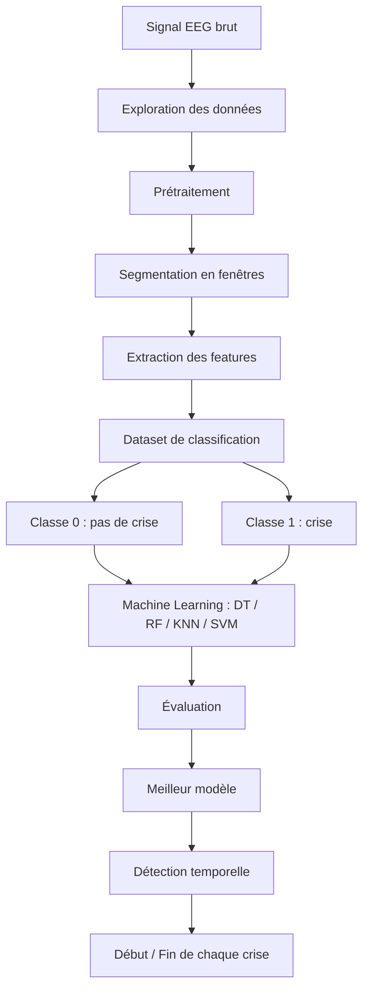

# Détection automatique des crises d'absence à partir de signaux EEG

> **Data Mining appliqué aux données biomédicales** 


---

## 📑 Table des matières

1. [Contexte](#-contexte)
2. [Objectifs](#-objectifs)
3. [Données](#-données)
4. [Pipeline du projet](#-pipeline-du-projet)
5. [Méthodologie détaillée](#-méthodologie-détaillée)
6. [Structure du dépôt](#-structure-du-dépôt)
7. [Installation](#-installation)
8. [Utilisation](#-utilisation)
9. [Résultats](#-résultats)
10. [Limites et perspectives](#-limites-et-perspectives)
11. [Équipe](#-équipe)

---

## 🩺 Contexte

L'**électroencéphalogramme (EEG)** enregistre l'activité électrique du cerveau grâce à des électrodes placées sur le cuir chevelu. Ce projet s'intéresse à la **détection automatique des crises d'absence** à partir de ces signaux.

Un enregistrement EEG peut contenir plusieurs épisodes de crise. Chaque crise est caractérisée par :

- un **instant de début** ;
- un **instant de fin** ;
- une **durée**.

L'objectif est de construire une **chaîne complète de Data Mining** permettant de passer du **signal EEG brut** à un **modèle capable de détecter automatiquement les périodes de crise**.

| | |
|---|---|
| **Compétences** | Data Mining (obligatoire), Python (intermédiaire), Machine Learning (bases), Traitement du signal (notions simples) |

---

## 🎯 Objectifs

À la fin du projet, nous serons capables de :

- manipuler des données EEG stockées dans des fichiers Excel ;
- visualiser les signaux et les résultats ;
- **segmenter** un signal en fenêtres temporelles ;
- **construire des features** (temporelles et fréquentielles) à partir d'un signal ;
- constituer un jeu de données pour le Machine Learning ;
- appliquer et **comparer** plusieurs algorithmes de classification ;
- interpréter une **matrice de confusion** ;
- discuter les **limites** d'un modèle de détection de crises ;
- **reconstruire les périodes de crise** à partir des prédictions du modèle.

---

## 📂 Données

On a plusieurs fichiers EEG. Chaque fichier correspond à un enregistrement de plusieurs minutes.

### Fichiers EEG

| Colonne | Description |
|---|---|
| `Time` | Temps en secondes |
| `EEG canal 1` | Amplitude du signal EEG enregistrée sur le canal 1 |
| `EEG canal 2` | Amplitude du signal EEG enregistrée sur le canal 2 |
| … | … |
| `EEG canal N` | Amplitude du signal EEG enregistrée sur le canal N |

### Fichier d'annotations

`Annotations.xlsx` contient les **instants de début et de fin** des crises pour chaque enregistrement. Un même enregistrement peut contenir **plusieurs crises**.

> ⚠️ **Les données ne sont pas versionnées sur GitHub** (taille, confidentialité des données biomédicales). Placer les fichiers dans le dossier `data/raw/` avant d'exécuter le notebook.

---

## 🔄 Pipeline du projet



---

## 🔬 Méthodologie détaillée

### Partie I – Compréhension et exploration des données
- Chargement d'un fichier EEG avec Python.
- Identification : nombre de lignes, nombre de variables, **fréquence d'échantillonnage**, durée totale, valeurs manquantes.
- Affichage des premières lignes et **tracé du signal** en fonction du temps.

### Partie II – Exploitation des annotations
- Lecture de `Annotations.xlsx`.
- Extraction automatique du début, de la fin et du nombre total de crises.
- Statistiques : durée moyenne, minimale, maximale, intervalle moyen entre deux crises.

### Partie III – Construction de la variable cible
Pour chaque échantillon, création d'une colonne `Class` :

- `0` → absence de crise
- `1` → crise (l'instant est dans un intervalle `[début crise, fin crise]`)

Visualisation du signal avec périodes « hors crise » / « pendant crise » et calcul du **déséquilibre** entre classes.

### Partie IV – Segmentation du signal
Travailler échantillon par échantillon n'est pas recommandé : le signal est découpé en **fenêtres temporelles**.

- Taille de fenêtre : **2 secondes**
- Recouvrement : **50 %**
- Exemple : à 256 Hz, 2 s = **512 échantillons**
- Une fenêtre est de **classe 1** si au moins **50 %** de ses échantillons appartiennent à une crise.

### Partie V – Extraction des caractéristiques temporelles
Pour chaque fenêtre : moyenne, écart-type, variance, minimum, maximum, amplitude, RMS, énergie.

Structure du dataset final :

| Window | Mean | Std | Variance | Min | Max | RMS | Energy | Class |
|---|---|---|---|---|---|---|---|---|
| 1 | … | … | … | … | … | … | … | 0 |
| 2 | … | … | … | … | … | … | … | 1 |

### Partie VI – Analyse fréquentielle
Calcul de la **FFT** pour chaque fenêtre, puis de la puissance dans les bandes :

| Bande | Fréquence |
|---|---|
| Delta | 0.5 – 4 Hz |
| Theta | 4 – 8 Hz |
| Alpha | 8 – 13 Hz |
| Beta | 13 – 30 Hz |

### Partie VII – Analyse exploratoire
Comparaison des features entre les deux classes, matrice de corrélation, identification des variables redondantes et discriminantes.

### Partie VIII – Construction des modèles
Séparation **80 % entraînement / 20 % test** (stratifiée). Modèles :

1. Decision Tree
2. Random Forest
3. K-Nearest Neighbors (KNN)
4. Support Vector Machine (SVM)

### Partie IX – Évaluation
Accuracy, Precision, Recall, F1-score et matrice de confusion pour chaque modèle.

> **Pourquoi l'accuracy seule est trompeuse ?** Les crises étant rares (ex. 5 % des fenêtres), un modèle qui prédit toujours « pas de crise » obtient déjà 95 % d'accuracy sans détecter aucune crise. Les métriques **Recall** et **F1-score** sont donc privilégiées.

### Partie X – Détection temporelle des crises
À partir des prédictions du meilleur modèle, reconstruction des intervalles de crise (début → fin, en secondes) et comparaison graphique avec les annotations réelles.

### Partie XI – Analyse des erreurs
Identification des faux positifs, faux négatifs, vrais positifs et vrais négatifs du meilleur modèle.

### Partie XII – Améliorations
Au moins deux pistes parmi : taille des fenêtres, recouvrement, nouvelles features, sélection de features, normalisation, hyperparamètres, autre méthode de classification, deep learning, traitement du déséquilibre des classes.

---

## 🗂️ Structure du dépôt

```
.
├── README.md
├── requirements.txt
├── .gitignore
├── data/
│   ├── raw/                 # Fichiers EEG + Annotations.xlsx (non versionnés)
│   └── processed/           # Datasets de features générés
├── notebooks/
│   └── projet_eeg.ipynb     # Notebook principal (pipeline complet)
├── src/                     # (optionnel) fonctions réutilisables
├── figures/                 # Graphiques exportés pour le rapport
└── report/
    └── rapport.pdf          # Rapport final
```

---

## ⚙️ Installation

```bash
# 1. Cloner le dépôt
git clone https://github.com/<votre-utilisateur>/<nom-du-depot>.git
cd <nom-du-depot>

# 2. (Recommandé) Créer un environnement virtuel
python -m venv venv
source venv/bin/activate        # Linux / macOS
venv\Scripts\activate           # Windows

# 3. Installer les dépendances
pip install -r requirements.txt
```

### Outils utilisés

| Outil | Usage |
|---|---|
| **Jupyter / Google Colab** | Environnement de travail |
| **pandas** | Lecture des fichiers Excel, manipulation des données |
| **numpy** | Calculs numériques, FFT |
| **scipy** | Traitement du signal |
| **matplotlib / seaborn** | Visualisations |
| **scikit-learn** | Modèles, métriques, découpage train/test |
| **openpyxl** | Lecture des fichiers `.xlsx` |

---

## ▶️ Utilisation

1. Placer les fichiers EEG et `Annotations.xlsx` dans `data/raw/`.
2. Lancer Jupyter :
   ```bash
   jupyter notebook
   ```
3. Ouvrir `notebooks/projet_eeg.ipynb` et exécuter les cellules dans l'ordre.

> Sur Google Colab, importer les données dans le stockage de session ou monter Google Drive, puis adapter les chemins.

---

## 📊 Résultats

> 🚧 *À compléter au fil de l'avancement du projet.*

### Comparaison des modèles

| Modèle | Accuracy | Precision | Recall | F1-score |
|---|---|---|---|---|
| Decision Tree | … | … | … | … |
| Random Forest | … | … | … | … |
| KNN | … | … | … | … |
| SVM | … | … | … | … |

**Meilleur modèle :** *à déterminer*

### Crises détectées vs crises réelles

| Crise | Début réel (s) | Fin réelle (s) | Début détecté (s) | Fin détectée (s) |
|---|---|---|---|---|
| 1 | … | … | … | … |

---

## ⚠️ Limites et perspectives

*À compléter à la fin du projet* (limites du modèle, risque de fuite de données avec le recouvrement des fenêtres, généralisation à d'autres patients, améliorations envisagées).

---

## 
| Hamza ESSOUSSI |


**Encadrant :*Mme Ines Bouzouita*  
**Établissement :** *ENIT*  


---

## 📄 Licence

Projet réalisé à des fins pédagogiques.
